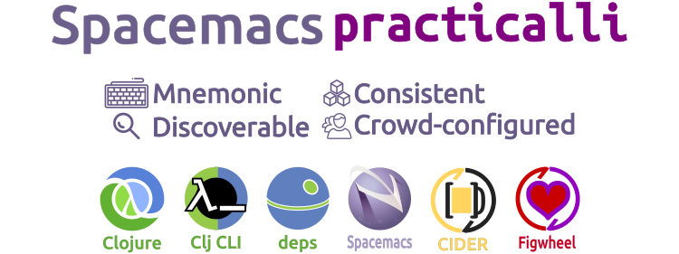

# Clojure development with Spacemacs

This is an introduction to developing Clojure applications using Emacs, specifically based on the Spacemacs configuration for Emacs and CIDER.  The aim is to help you be productive with those tools as quickly as possible.

Spacemacs is a community-driven project that provides a simple way to add lots of extra functionality to Emacs, without having to manage packages yourself or spend time writing common configuration code.

.

[Create a free Clojurians Slack community account](http://clojurians.net/).

This workshop will cover the following topics:
* Emacs basics, common commands and tools
* Powerful editing and refactor tools (iedt, narrowing, helm-ag, multiple cursors, visual undo)
* Adding and enhancing the Clojure layer
* Running the REPL, evaluating code, inspecting data, debug, reloaded workflow
* Running tests & test reports
* Structural editing (smartparens/evil-cleverparens)
* Clojure docs, auto-completion, snippets
* Clojurescript development, figwheel-main and reagent
* Org-mode for project documentation, literate programming & presentations

> This is not a guide to customising Emacs for Clojure development, except were there are useful additions to be made to Spacemacs and the Clojure layer.

## Contributing
Issues and pull requests are most welcome.  Please detail issues as much as you can.  Pull requests are easier when they are specific to a page or at most a section.  The smaller the change the quicker it is to review and merge.

* [Kanban board of issues](https://github.com/practicalli/spacemacs-content/projects/1)
* [Current Issues](https://github.com/practicalli/spacemacs-content/issues)
* [Current pull requests](https://github.com/practicalli/spacemacs-content/pulls)

[practicalli/spacemacs.d ](https://github.com/practicalli/spacemacs.d/)GitHub repository contains the complete Spacemacs configuration used in this guide and issues and pull requests can also be made there.

---

This work is licensed under a Creative Commons Attribution 4.0 ShareAlike License (including images & stylesheets).

 Spacemacs, Practicalli by <a xmlns:cc="http://creativecommons.org/ns#" href="spacemacs.practical.li" property="cc:attributionName" rel="cc:attributionURL">John Stevenson</a> is licensed under a <a rel="license" href="http://creativecommons.org/licenses/by-sa/4.0/">Creative Commons Attribution-ShareAlike 4.0 International License</a>. Based on a work at <a xmlns:dct="http://purl.org/dc/terms/" href="https://github.com/practicalli/spacemacs" rel="dct:source">Spacemacs, Practicalli on Gitub</a>. Permissions beyond the scope of this license may be available at <a xmlns:cc="http://creativecommons.org/ns#" href="https://twitter.com/practical_li" rel="cc:morePermissions">@practical_li</a>.
