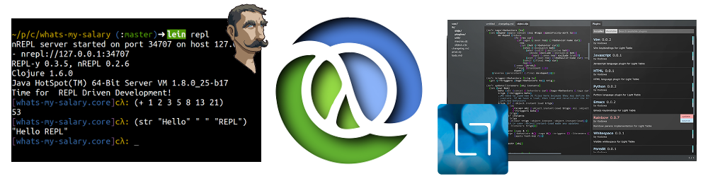

# Clojure development with Spacemacs & CIDER

This work is licensed under a Creative Commons Attribution 3.0 Unported License (including images & stylesheets).

This is an introduction to developing Clojure applications using Emacs, specifically based on the Spacemacs configuration for Emacs and CIDER.  The aim is to help you be productive with those tools as quickly as possible.

This is not a guide to customising Emacs for Clojure development, except were there are useful additions to be made to Spacemacs.  Please see ... if you are using Emacs without Spacemacs

## Requirements 

  * A working Java runtime environment (JRE) - test with `java -version` in a command line window
  * [Leiningen](http://leiningen.org/) - test with `lein version` in a command line window
  * A Clojure aware editor with REPL
    - [LightTable](http://lighttable.com/)
    - [Emacs](http://www.gnu.org/software/emacs/) with either [Emacs Live](https://github.com/overtone/emacs-live), [Spacemacs](https://github.com/syl20bnr/spacemacs) or [CIDER](https://github.com/clojure-emacs/cider)
  * A [Git client](http://git-scm.com/) (optional)
  * [A free Heroku account](http://heroku.com) for running Postgres database (alternatively install Posgtres database on your laptop)

  See the [setup](/setup/) section for details on how to get your environment ready

## Code for the workshop
The code for this workshop is contained in the Github repository [Clojure Webapps example](https://github.com/practicalli/clojure-webapps-example), the code for each section is in a specific branch.

To get a copy of the repository, use the following git clone command which creates a new directory called clojure-webapps-example that contains the cloned code. 

`git clone https://github.com/practicalli/clojure-webapps-example.git`

Once you have the repository, use `git checkout branch-name` to get the code for each section.  Each branch is a working application with all the features covered in that section

Use `git branch` to show all the branches available, they should match the names of the sections in this workshop.

Enjoy.

## Additional Resources

**Getting Started**
* [ClojureBridge London curiculum](http://clojurebridgelondon.github.io/curriculum)
* [Clojure through code](https://github.com/practicalli/clojure-through-code/tree/drafts) - many examples of basic Clojure code
* [Getting started with Clojure](http://jr0cket.co.uk/slides/getting-started-with-clojure.html) - a general guide to Clojure (work in progress)
* [4Clojure](https://www.4clojure.com/) exercises & [4Clojure Google group](https://groups.google.com/forum/#!forum/4clojure)
* [Lighttable Koans](https://github.com/practicalli/lighttable-koans) - exercises to help you discover Clojure 
* [Brave Clojure](http://www.braveclojure.com/) - a Clojure tutorial (using Emacs)
* [Getting started with Clojure on Heroku](https://github.com/jr0cket/clojure-getting-started)

**Clojure**
* [Clojure.org](http://clojure.org), [features](http://clojure.org/features) and [rational](http://clojure.org/rationale)
* [Clojure documentation](http://clojure.org/documentation)
* [Clojure cheetsheet](http://clojure.org/cheatsheet)
* [Official Google group](https://groups.google.com/forum/#!forum/clojure)
* [CrossClj](http://crossclj.info/) - cross-referencing the Clojure ecosystem

**Tooling**
* [Leiningen](http://leiningen.org/), [tutorial](https://github.com/technomancy/leiningen/blob/stable/doc/TUTORIAL.md), [faq](https://github.com/technomancy/leiningen/blob/stable/doc/FAQ.md), [plugins list](https://github.com/technomancy/leiningen/wiki/Plugins) & [sample project file](https://github.com/technomancy/leiningen/blob/stable/sample.project.clj)
* [LightTable](http://lighttable.com/), [docs](http://docs.lighttable.com/), [blog](http://www.lighttable.com/blog/), [announcements](https://groups.google.com/forum/#!forum/light-table) and [discussions](https://groups.google.com/forum/#!forum/light-table-discussion).
* [Emacs Live discussion group](https://groups.google.com/forum/#!forum/emacs-live)
* [Gorilla REPL](http://gorilla-repl.org/) - browser based REPL & tool for creating documents with live running Clojure code

**Community**
* [Clojure-docs](http://clojure-doc.org/) - community docs 
* [CrossCLJ](http://crossclj.info/) - cross-referencing the Clojure ecosystem
* [London Clojurians]() and their [Google group](https://groups.google.com/forum/#!forum/london-clojurians)
* [Uncle Bob presents Clojure](https://www.youtube.com/watch?v=SYeDxWKftfA)

**Books & Tutorials**
* [Clojure cookbook](https://github.com/clojure-cookbook/clojure-cookbook)

**Database** 
* [Testing databases faster - using rollbacks](http://www.lispcast.com/clojure-database-test-faster)

| Author | Date |
| -- | -- |
|John Stevenson | Fri 13 Nov 2015 22:43:30 BST |

---

 Spacemacs, Practicalli by <a xmlns:cc="http://creativecommons.org/ns#" href="spacemacs.practical.li" property="cc:attributionName" rel="cc:attributionURL">John Stevenson</a> is licensed under a <a rel="license" href="http://creativecommons.org/licenses/by-sa/4.0/">Creative Commons Attribution-ShareAlike 4.0 International License</a>. Based on a work at <a xmlns:dct="http://purl.org/dc/terms/" href="https://github.com/practicalli/spacemacs" rel="dct:source">Spacemacs, Practicalli on Gitub</a>. Permissions beyond the scope of this license may be available at <a xmlns:cc="http://creativecommons.org/ns#" href="https://twitter.com/jr0cket" rel="cc:morePermissions">@jr0cket</a>.
