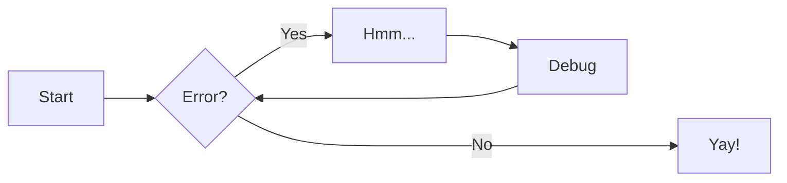
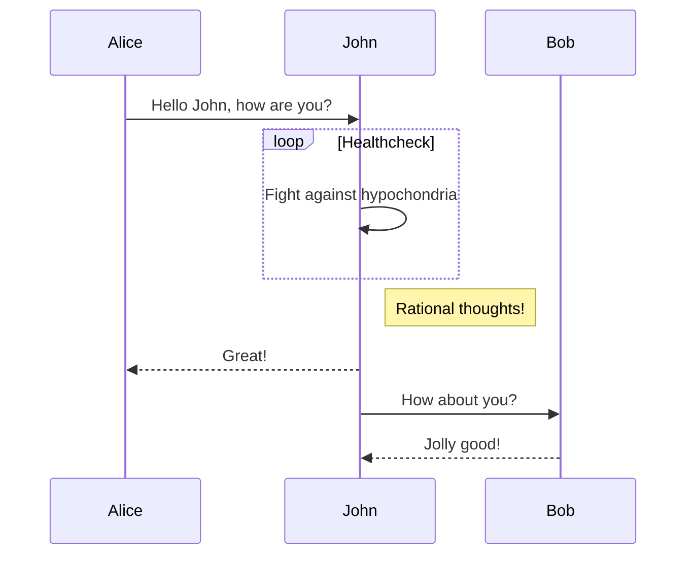
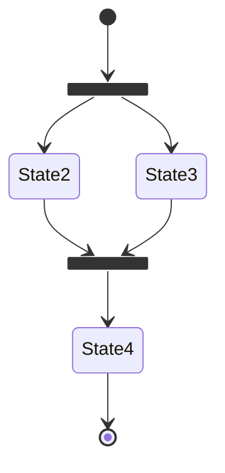
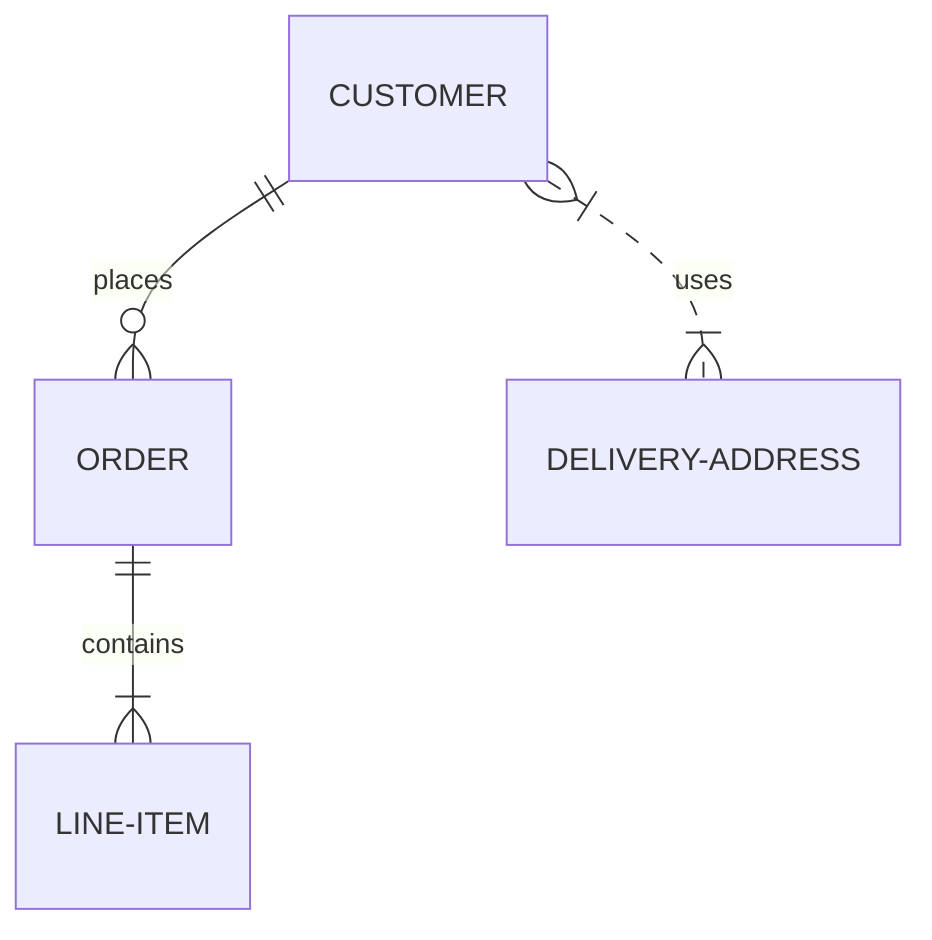

# Writing tips for MkDocs

Making the docs more engaging using the [mkdocs-material theme reference guide](https://squidfunk.github.io/mkdocs-material/reference/)

## Hypertext links

Links open in the same browser window/tab by default.

Add `{target=_blank}` to the end of a link to configure opening in a new tab

```markdown
[link text](url){target=_blank}
```

## Buttons

Convert any link into a button by adding `{ .md-button }` class names to end of the markdown for a link, which uses `.md-button-primary` by default.  Include `target=_blank` for buttons with links to external sites.

```
[link text](http://practical.li/blog){ .md-button target=_blank }
```

[:octicons-heart-fill-24: Practicalli Blog](http://practical.li/blog){ .md-button .md-button-primary }

Add an icon to the button with fontawsome

[:fontawesome-brands-github: Practicalli Issues](http://practical.li/blog){ .md-button .md-button-primary }


## YouTube video

Use an iframe element to include a YouTube video, wrapping in a paragraph tag with center alignment to place the video in a centered horizontal position

```html
<p style="text-align:center">
<iframe width="560" height="315" src="https://www.youtube.com/embed/rQ802kSaip4" title="YouTube video player" frameborder="0" allow="accelerometer; autoplay; clipboard-write; encrypted-media; gyroscope; picture-in-picture" allowfullscreen></iframe>
</p>
```

> mkdocs material does not have direct support for adding a YouTube video via markdown.


## Admonitions

[Supported admonition types](https://squidfunk.github.io/mkdocs-material/reference/admonitions/#supported-types)

!!! NOTE
    Use `!!!` followed by `NOTE`

!!! NOTE "Adding a title"
    Use `!!!` followed by `NOTE` and a `"title in double quotes"`

!!! NOTE ""
    Shh, no title bar just the text...
    Use `!!!` followed by `NOTE` and a `""` empty double quotes

!!! ABSTRACT
    Use `!!!` followed by `ABSTRACT`

!!! INFO
    Use `!!!` followed by `INFO`

!!! TIP
    Use `!!!` followed by `TIP`

!!! SUCCESS
    Use `!!!` followed by `SUCCESS`

!!! QUESTION
    Use `!!!` followed by `QUESTION`

!!! WARNING
    Use `!!!` followed by `WARNING`

!!! FAILURE
    Use `!!!` followed by `FAILURE`

!!! DANGER
    Use `!!!` followed by `DANGER`

!!! BUG
    Use `!!!` followed by `BUG`

!!! EXAMPLE
    Use `!!!` followed by `EXAMPLE`

!!! QUOTE
    Use `!!!` followed by `QUOTE`


### Collapsing admonitions

??? NOTE
    Collapse those admonitions using `???` instead of `!!!`

??? NOTE "Replace with a title"
    Use `???` followed by `NOTE` and a `"title in double quotes"`


???+ NOTE "Expanded by default"
     Use `???+`, note the `+` character,  followed by `NOTE` and a `"title in double quotes"`


### Inline blocks

Inline blocks of text to make a very specific callout within text

!!! info inline

    Lorem ipsum dolor sit amet, consectetur
    adipiscing elit. Nulla et euismod nulla.
    Curabitur feugiat, tortor non consequat
    finibus, justo purus auctor massa, nec
    semper lorem quam in massa.


Lorem ipsum dolor sit amet, consectetur adipiscing elit. Nulla et euismod nulla. Curabitur feugiat, tortor non consequat finibus, justo purus auctor massa, nec semper lorem quam in massa.

Lorem ipsum dolor sit amet, consectetur adipiscing elit. Nulla et euismod nulla. Curabitur feugiat, tortor non consequat finibus, justo purus auctor massa, nec semper lorem quam in massa.

Adding something to then end of text is probably my favourite

!!! info inline end

    Lorem ipsum dolor sit amet, consectetur
    adipiscing elit. Nulla et euismod nulla.
    Curabitur feugiat, tortor non consequat
    finibus, justo purus auctor massa, nec
    semper lorem quam in massa.


Lorem ipsum dolor sit amet, consectetur adipiscing elit. Nulla et euismod nulla. Curabitur feugiat, tortor non consequat finibus, justo purus auctor massa, nec semper lorem quam in massa.

Lorem ipsum dolor sit amet, consectetur adipiscing elit. Nulla et euismod nulla. Curabitur feugiat, tortor non consequat finibus, justo purus auctor massa, nec semper lorem quam in massa.


## Code blocks

Code blocks include a copy icon automatically

Syntax highlighting in code blocks

```clojure
(defn my-function  ; Write a simple function
  "With a lovely doc-string"
  [arguments]
  (map inc [1 2 3]))
```

Give the code block a title using `title=""` after the backtics and language name


```clojure title="src/practicalli/gameboard.clj"
(defn my-function
  "With a lovely doc-string"
  [arguments]
  (map inc [1 2 3]))
```

We all like line numbers, especially when you can set the starting line

```clojure linenums="42" title="src/practicalli/gameboard.clj"
(defn my-function
  "With a lovely doc-string"
  [arguments]
  (map inc [1 2 3]))
```

Add `linenums=42` to start line numbers from 42 onward

```
clojure linenums="42" title="src/practicalli/gameboard.clj"
```


### Annotations

Add an annotation using `# (1)` where 1 is the number of the annotation

```shell
ls -la $HOME/Downloads  # (1)
```

    1.  :woman_raising_hand: I'm a code annotation! I can contain `code`, __formatted text__, images, ... basically anything that can be written in Markdown.


Code blocks with annotation, add `!` after the annotation number to suppress the `#` character

```clojure
(defn helper-function
  "Doc-string with description of function purpose" ; (1)!
  [data]
  (merge {:fish 1} data)
  )
```
1.  Always include a doc-string in every function to describe the purpose of that function, identifying why it was added and what its value is.


GitHub action example with multiple annotations


GitHub action example with multiple annotations

``` yaml
name: ci # (1)!
on:
  push:
    branches:
      - master # (2)!
      - main
permissions:
  contents: write
jobs:
  deploy:
    runs-on: ubuntu-latest
    steps:
      - uses: actions/checkout@v3
      - uses: actions/setup-python@v4
        with:
          python-version: 3.x
      - run: pip install mkdocs-material # (3)!
      - run: mkdocs gh-deploy --force
```

1.  You can change the name to your liking.

2.  At some point, GitHub renamed `master` to `main`. If your default branch
    is named `master`, you can safely remove `main`, vice versa.

3.  This is the place to install further [MkDocs plugins] or Markdown
    extensions with `pip` to be used during the build:

    ``` sh
    pip install \
      mkdocs-material \
      mkdocs-awesome-pages-plugin \
      ...
    ```


### Highlight lines in code blocks

`hl_lines="2"` where 2 is the line number to highlight


```clojure hl_lines="2"
(defn my-function
  "With a lovely doc-string"
  [arguments]
  (map inc [1 2 3]))
```


## Content tabs

Create in page tabs that can also be

Setting up a project

=== "Clojure CLI"
    ```shell
    clojure -T:project/new :template app :name practicalli/gameboard
    ```


=== "Leiningen"
    ```shell
    lein new app practicalli/gameboard
    ```


Or nest the content tabs in an admonition


!!! INFO "Run a terminal REPL"

    === "Clojure CLI"
        ```shell
        clojure -T:repl/rebel
        ```


    === "Leiningen"
        ```shell
        lein repl
        ```


## Diagrams

Neat flow diagrams




UML Sequence Diagrams



state transition diagrams




Class diagrams - but dont need them.

Entity relationship diagrams are handy though



### Other diagram types

Besides the diagram types listed above, [Mermaid.js] provides support for
[pie charts], [gantt charts], [user journeys], [git graphs] and
[requirement diagrams], all of which are not officially supported by Material
for MkDocs. Those diagrams should still work as advertised by [Mermaid.js], but
we don't consider them a good choice, mostly as they don't work well on mobile.

  [pie charts]: https://mermaid-js.github.io/mermaid/#/pie
  [gantt charts]: https://mermaid-js.github.io/mermaid/#/gantt
  [user journeys]: https://mermaid-js.github.io/mermaid/#/user-journey
  [git graphs]: https://mermaid-js.github.io/mermaid/#/gitgraph
  [requirement diagrams]: https://mermaid-js.github.io/mermaid/#/requirementDiagram


## Formatting

[Keyboard keys] for all those key bindings... each number and alphabet character has their own key

++spc++ or ++space++ for leader and ++comma++ for local leader

[Punctionation keys](https://facelessuser.github.io/pymdown-extensions/extensions/keys/#punctuation-keys) by name, e.g. ++bar++

++arrow-left+arrow-up+arrow-down+arrow-right++

++meta+x++ for all the classic Emacs fun

++ctrl+alt+del++

[Keyboard keys]: https://facelessuser.github.io/pymdown-extensions/extensions/keys/#extendingmodifying-key-map-index


## Grids

Useful for putting button links on the main page as quick links into the key parts of the book

<div class="grid cards" markdown>

- :fontawesome-brands-html5: __HTML__ for content and structure
- :fontawesome-brands-js: __JavaScript__ for interactivity
- :fontawesome-brands-css3: __CSS__ for text running out of boxes
- :fontawesome-brands-internet-explorer: __Internet Explorer__ ... huh?

</div>

> Sponsor only feature


## Images

Oh yesssss... aligning images... I am in love... and lazy loading too

{ align=right loading=lazy }

Lorem ipsum dolor sit amet, consectetur adipiscing elit. Nulla et euismod nulla. Curabitur feugiat, tortor non consequat finibus, justo purus auctor massa, nec semper lorem quam in massa.

> If the image is too big then it will simply take up the whole width of the page


When adding the [color pallet toggle](https://squidfunk.github.io/mkdocs-material/setup/changing-the-colors/#color-palette-toggle), have different images for light and dark


## Lists

Task lists

- [x] Lorem ipsum dolor sit amet, consectetur adipiscing elit
- [ ] Vestibulum convallis sit amet nisi a tincidunt
    * [x] In hac habitasse platea dictumst
    * [x] In scelerisque nibh non dolor mollis congue sed et metus
    * [ ] Praesent sed risus massa
- [ ] Aenean pretium efficitur erat, donec pharetra, ligula non scelerisque


## Tooltips

The humble tool tip

[Hover me](https://example.com "I'm a tooltip!")

with references

[Hover me][example]

  [example]: https://example.com "I'm a tooltip!"


Icon tool tip with a title

:material-information-outline:{ title="Important information" }


### Abreviations

The HTML specification is maintained by the W3C.

*[HTML]: Hyper Text Markup Language
*[W3C]: World Wide Web Consortium


## Magic links

[MagicLink](https://facelessuser.github.io/pymdown-extensions/extensions/magiclink/) can auto-link HTML, FTP, and email links. It can auto-convert repository links (GitHub, GitLab, and Bitbucket) and display them in a more concise, shorthand format.

[Email Practicalli](mailto:info@)

[Practicalli Neovim](https://github.com/practicalli/neovim)
