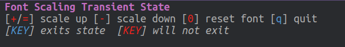
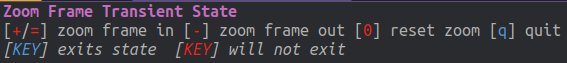

# Changing Fonts and Zooming

You can change the font to any currently installed on your computer.  The default font is [Source Code Pro](https://adobe-fonts.github.io/source-code-pro/).

I set the default font to Ubuntu Mono from the freely available [Ubuntu Font Family](http://font.ubuntu.com/).

Edit the `dotspacemacs-default-font` settting in the `~/.spacemacs` file

```lisp
   dotspacemacs-default-font '("Ubuntu Mono"
                               :size 16
                               :weight normal
                               :width normal)
```

> ####Hint:: Powerline graphics adjustment
> If the powerline graphics looks a little corrupted, then adjust the `:powerline-scale` value by `0.1` either way until it looks correct.


## Zooming - Emacs Frame and Font Size

Changing font size of your buffer or zooming the size of your frame is useful for demos and presentation or other times you share your screen.

Use the Spacemacs Zoom menu to enter a transient state that will let you zoom text or frame size

| Spacemacs | Emacs     | Description                   |
|-----------|-----------|-------------------------------|
| `SPC z f` | `M-m z f` | Zoom Frame Transient State    |
| `SPC z x` | `M-m z x` | Font Scalling Transient State |

[](../images/spacemacs-zoom-text-transient-state-font-scaling.png)


[](../images/spacemacs-zoom-frame-scale-transient-state.png)

> ####Hint::
> Adjusting the font size of a buffer is not permanent and only applies to the currently highlighted buffer.  If the font size is often too big or to small, then adjust the default font size as shown above.
