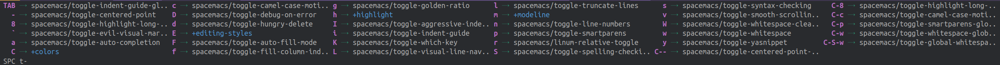

# Line Numbers

Line numbers can be toggled for individual buffers via the Spacemacs toggle menu or can be set permanently on in the `.spacemacs` file so all buffers show line numbers.

Line numbers can be the normal sequential numbers or be relative to the current position.

With relative numbering, the current line number is shown in the gutter and all other numbers are relative to the number of lines away they are from the current number.  Relative numbering is useful for jumping to different parts of your file or running commands on a number of lines (eg. delete, indent)

> Avy goto line is an efficient alternative to line numbers, allowing you to jump to any visible line in any visible buffer.  Run avy goto line with `SPC j i` and then use the character line number to jump to the line you want.


## Toggling line numbers per buffer

You can toggle line numbers with `SPC t n` or relative line numbers (linum) with `SPC t n`

| Spacemacs | Emacs     | Description                  |
|-----------|-----------|------------------------------|
| `SPC T n` | `M-m t n` | Toggle line numbers          |
| `SPC T r` | `M-m t r` | Toggle relative line numbers |

[](../images/spacemacs-toggle-menu.png)


## Setting Line numbers for all buffers

If the value of `dotspacemacs-line-numbers` is set to something other than `nil` then line numbers are turned on in all modes that are in either `prog-mode` or `text-mode`  If the value is set to `relative`, then relative line numbers are turned on for all these modes.

Open the `.spacemacs` file (`SPC f e d`) and search (`/` or `C-s`) for `dotspacemacs-line-numbers`

For line numbers, set the value to true

```elisp
dotspacemacs-line-numbers t
```


For relative line numbers, set the value to relative

```elisp
dotspacemacs-line-numbers 'relative
```


If you want to turn line numbers off for all buffers by default, set the value back to the default `nil` value.

```elisp
dotspacemacs-line-numbers nil
```


 
