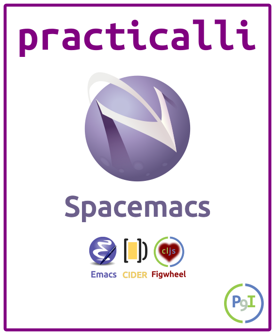

# Practicalli Spacemacs

A practical guide to Clojure development with Spacemacs, a community driven Emacs configuration that makes it easy to use all the power of Emacs and Vim.


https://youtu.be/ZKuQDrQLAnc


<table>
  <tr>
    <td>
      
    </td>
   <td>
      
    </td>
    <td>
      
    </td>
    <td>
      
    </td>
    <td>
      
    </td>
  </tr>
</table>

[Emacs](https://www.gnu.org/software/emacs/) has been a shining beacon of Free and Open Source software from the early 1970's and has grown to be a versatile set of development tools for all languages.  This long history has given [Emacs](https://www.gnu.org/software/emacs/) the ability to interact with almost every aspect of your digital life.

[Spacemacs](http://spacemacs.org/) is a community configuration providing a consistent and simple to learn approach to using all the features and power of [Emacs](https://www.gnu.org/software/emacs/).  [Spacemacs](https://spacemacs.org) also integrates the raw text manipulation speed of Vim and multi-modal editing into the Emacs experience, enabling you to be even more productive.

---

This work is licensed under a Creative Commons Attribution 4.0 ShareAlike License (including images & stylesheets).

Spacemacs, Practicalli by <a xmlns:cc="http://creativecommons.org/ns#" href="spacemacs.practical.li" property="cc:attributionName" rel="cc:attributionURL">John Stevenson</a> is licensed under a <a rel="license" href="http://creativecommons.org/licenses/by-sa/4.0/">Creative Commons Attribution-ShareAlike 4.0 International License</a>. Based on a work at <a xmlns:dct="http://purl.org/dc/terms/" href="https://github.com/practicalli/spacemacs" rel="dct:source">Spacemacs, Practicalli on Gitub</a>. Permissions beyond the scope of this license may be available at <a xmlns:cc="http://creativecommons.org/ns#" href="https://twitter.com/jr0cket" rel="cc:morePermissions">@jr0cket</a>.

