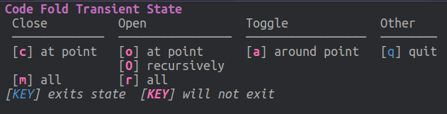

# Code folding

Code folding allows you to collapse a code block onto one line, allowing you to see more of your code in the window.  A code block for Clojure includes **def**, **defn** and the threading macros **->** and **-->**.

> **FIXME** TODO: Add a video of Code folding in action

## Fold Transient State

You can use a transient state for folding code via `SPC z .`, which seems to be most useful when reviewing code.

## Evil state

When actively developing or refactoring code, the Vim normal state has a zoom menu via the `z` key as follows

| Evil state  | Command            | Description                        |
|-------------|--------------------|------------------------------------|
| `z c`       | `evil-close-fold`  | Folds a code block                 |
| `z o`       | `evil-open-fold`   | Opens a folded code block          |
| `z a`       | `evil-toggle-fold` | Toggle fold for current code block |
| `z r`       | `evil-open-folds`  | Opens all folded code blocs        |
| `z m`       | `evil-close-folds` | Folds all code blocks in buffer    |

