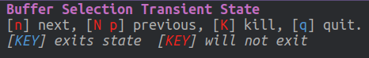

# Buffer management 

Using the buffer menu, `SPC b b` you can switch to any buffer currently open, especially those buffers that are not currently being shown in a window.

You can also delete any of the currently open buffers.

## Buffer Transient State

If you want to manage multiple buffers then the buffer transient state is idea, `SPC b .`

With a single key you can cycle quickly through all open buffers, forward with `n` or backwards with either `N` or `p`.

Use `k` to kill the current buffer.

| Evil       | Command | Description                     |
|------------|---------|---------------------------------|
| `SPC b .`  |         | Enter buffer transient state    |
| `n`        |         | Show next buffer                |
| `N` or `p` |         | Show previous buffer            |
| `q`        |         | Quit the buffer transient state |

## Deleting buffers using buffer menu 

The buffer transient state is the simplest way to delete buffers, however if there are a large number of buffers you wish to delete then using the buffer helm-mini menu.

Open the buffer helm-mini menu with `SPC b b` (or `SPC B b` for global buffers - unsure of the difference)

Then move to any buffer names you want to delete by moving the cursor with `C-j` and `C-k`.

Mark a buffer for deletion using `C-SPC`

Once you have marked all the buffers, use `C-D` to delete the marked buffers.

